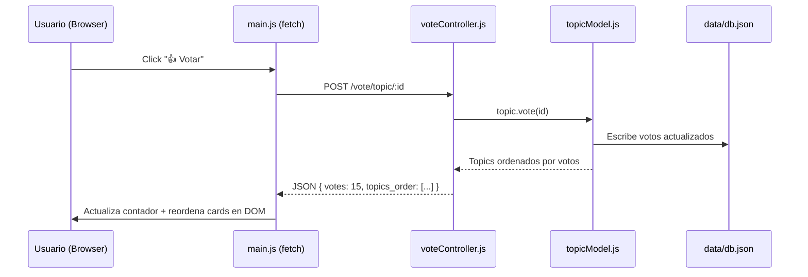
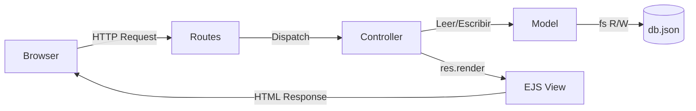

# Plataforma Educativa — "Learn It, Love It"

Sistema CRUD de temas de aprendizaje con votación en tiempo real, arquitectura MVC, Node.js + Express + EJS.

---

## Descripción General

Se construirá una plataforma educativa completa donde los usuarios pueden:
- **Crear, leer, actualizar y eliminar** temas de aprendizaje (topics).
- **Agregar, editar y eliminar enlaces** (links) dentro de cada tema.
- **Votar** por temas y por enlaces individuales con un solo clic (upvote).
- **Ver el contenido reordenado en tiempo real** según el número de votos, sin recargar la página.

La aplicación usa **datos en memoria (In-Memory Storage)** con un JSON serializado para persistencia entre reinicios. No se requiere base de datos externa.

---

## Decisiones de Diseño Clave

> [!IMPORTANT]
> **Persistencia**: Se usará un archivo `data/db.json` como almacén JSON en disco (lectura/escritura con `fs`). Esto cumple el requisito de "base de datos" sin instalar MongoDB u otro motor, manteniendo la solución 100% en Node.js puro.

> [!IMPORTANT]
> **Tiempo real (sin WebSockets)**: El requisito de "tiempo real" se implementará con **Fetch API + polling/respuesta inmediata**. Los botones de voto envían `POST` vía `fetch()`, el servidor responde con el nuevo conteo en JSON y el DOM se actualiza de forma inmediata sin recargar la página. Esto cumple el requisito con JS puro.

> [!NOTE]
> **Sin frameworks CSS externos**: Se usará CSS vanilla con un sistema de diseño moderno (variables CSS, glassmorphism, gradientes, dark mode). El requisito de Tailwind es opcional.

---

## Estructura de Archivos Propuesta

```
The_Huddle_Challenge_8_CodePro_4/
├── app.js                          ← Punto de entrada Express
├── package.json
├── data/
│   └── db.json                     ← Persistencia JSON en disco [NEW]
├── config/
│   └── database.js                 ← Helpers para leer/escribir db.json [NEW]
├── models/
│   ├── userModel.js                ← (vacío, no requerido por el reto)
│   ├── topicModel.js               ← Lógica de datos: topics + links [NEW]
│   └── linkModel.js                ← Lógica de datos: links dentro de topics [NEW]
├── controllers/
│   ├── userController.js           ← (vacío, no requerido)
│   ├── topicController.js          ← CRUD de topics [NEW]
│   ├── linkController.js           ← CRUD de links [NEW]
│   └── voteController.js           ← Sistema de votación [NEW]
├── routes/
│   ├── index.js                    ← Ruta raíz → topics list [MODIFY]
│   ├── topicRoutes.js              ← /topics/* [NEW]
│   ├── linkRoutes.js               ← /topics/:id/links/* [NEW]
│   └── voteRoutes.js               ← /vote/* [NEW]
├── views/
│   ├── layout/
│   │   └── main.ejs               ← Layout base con header/footer [NEW]
│   ├── topics/
│   │   ├── index.ejs              ← Lista de topics ordenada por votos [NEW]
│   │   ├── show.ejs               ← Detalle del topic + sus links [NEW]
│   │   ├── new.ejs                ← Formulario crear topic [NEW]
│   │   └── edit.ejs               ← Formulario editar topic [NEW]
│   ├── links/
│   │   ├── new.ejs                ← Formulario agregar link a topic [NEW]
│   │   └── edit.ejs               ← Formulario editar link [NEW]
│   └── index.ejs                  ← Redirect → topics/index [MODIFY]
├── public/
│   ├── css/
│   │   └── style.css              ← Diseño moderno con CSS Variables [NEW]
│   └── js/
│       └── main.js                ← JS puro: votos + reordenamiento DOM [NEW]
└── docs/
    └── challenge.txt
```

---

## Propuestas de Cambio por Componente

---

### 1. Punto de entrada — Servidor Express

#### [MODIFY] [app.js](file:///c:/Users/edgar.vega/Documents/VSCode/The_Huddle_Challenge_8_CodePro_4/app.js)

- Configurar Express, EJS como view engine, body-parser y static files.
- Montar todas las rutas: `/`, `/topics`, `/links`, `/vote`.
- Puerto configurable vía `process.env.PORT` (default 3000).

---

### 2. Capa de Datos (Config + Models)

#### [NEW] [database.js](file:///c:/Users/edgar.vega/Documents/VSCode/The_Huddle_Challenge_8_CodePro_4/config/database.js)

Helper con dos funciones:
- `readDB()` → Lee y parsea `data/db.json`.
- `writeDB(data)` → Serializa y guarda el JSON al disco.

Esquema del `db.json`:
```json
{
  "topics": [
    {
      "id": "uuid",
      "title": "string",
      "description": "string",
      "votes": 0,
      "createdAt": "ISO date",
      "links": [
        {
          "id": "uuid",
          "url": "string",
          "description": "string",
          "votes": 0,
          "createdAt": "ISO date"
        }
      ]
    }
  ]
}
```

#### [NEW] [topicModel.js](file:///c:/Users/edgar.vega/Documents/VSCode/The_Huddle_Challenge_8_CodePro_4/models/topicModel.js)

Métodos:
- `getAll()` → Retorna todos los topics ordenados por votos descendente.
- `getById(id)` → Busca topic por ID.
- `create({ title, description })` → Crea topic con UUID, votos=0.
- `update(id, { title, description })` → Actualiza campos.
- `delete(id)` → Elimina topic y sus links.
- `vote(id)` → Incrementa votos del topic en +1.

#### [NEW] [linkModel.js](file:///c:/Users/edgar.vega/Documents/VSCode/The_Huddle_Challenge_8_CodePro_4/models/linkModel.js)

Métodos:
- `getAllByTopic(topicId)` → Links del topic ordenados por votos.
- `getById(topicId, linkId)`.
- `create(topicId, { url, description })`.
- `update(topicId, linkId, { url, description })`.
- `delete(topicId, linkId)`.
- `vote(topicId, linkId)`.

---

### 3. Controladores (MVC — Cerebro)

#### [NEW] [topicController.js](file:///c:/Users/edgar.vega/Documents/VSCode/The_Huddle_Challenge_8_CodePro_4/controllers/topicController.js)

| Método | Ruta | Acción |
|--------|------|--------|
| `index` | GET `/topics` | Renderiza lista de topics |
| `show` | GET `/topics/:id` | Renderiza detalle del topic |
| `newForm` | GET `/topics/new` | Renderiza form de creación |
| `create` | POST `/topics` | Crea topic y redirige |
| `editForm` | GET `/topics/:id/edit` | Renderiza form de edición |
| `update` | PUT `/topics/:id` | Actualiza y redirige |
| `delete` | DELETE `/topics/:id` | Elimina y redirige |

#### [NEW] [linkController.js](file:///c:/Users/edgar.vega/Documents/VSCode/The_Huddle_Challenge_8_CodePro_4/controllers/linkController.js)

| Método | Ruta | Acción |
|--------|------|--------|
| `newForm` | GET `/topics/:id/links/new` | Form para agregar link |
| `create` | POST `/topics/:id/links` | Crea link |
| `editForm` | GET `/topics/:id/links/:lid/edit` | Form edición |
| `update` | PUT `/topics/:id/links/:lid` | Actualiza link |
| `delete` | DELETE `/topics/:id/links/:lid` | Elimina link |

#### [NEW] [voteController.js](file:///c:/Users/edgar.vega/Documents/VSCode/The_Huddle_Challenge_8_CodePro_4/controllers/voteController.js)

| Método | Ruta | Descripción |
|--------|------|-------------|
| `voteTopic` | POST `/vote/topic/:id` | Incrementa votos del topic; responde JSON `{ votes, topics_order }` |
| `voteLink` | POST `/vote/topic/:id/link/:lid` | Incrementa votos del link; responde JSON `{ votes, links_order }` |

> [!NOTE]
> Estos endpoints responden **JSON** (no HTML), lo que permite que el frontend actualice el DOM sin recargar.

---

### 4. Rutas

#### [MODIFY] [routes/index.js](file:///c:/Users/edgar.vega/Documents/VSCode/The_Huddle_Challenge_8_CodePro_4/routes/index.js)
- Redirige `/` → `/topics`.

#### [NEW] [routes/topicRoutes.js](file:///c:/Users/edgar.vega/Documents/VSCode/The_Huddle_Challenge_8_CodePro_4/routes/topicRoutes.js)
- Monta todas las rutas RESTful de topics + links anidados.

#### [NEW] [routes/voteRoutes.js](file:///c:/Users/edgar.vega/Documents/VSCode/The_Huddle_Challenge_8_CodePro_4/routes/voteRoutes.js)
- Monta `POST /vote/topic/:id` y `POST /vote/topic/:id/link/:lid`.

---

### 5. Vistas EJS

#### [NEW] `views/layout/main.ejs`
Layout base con:
- `<head>` con meta tags SEO, link a `style.css`.
- Header con logo de la plataforma y navegación.
- `<%- body %>` para inyectar contenido.
- Script de `main.js` al final del body.

#### [NEW] `views/topics/index.ejs`
- Lista de cards de topics, ordenadas por votos (el orden vendrá del servidor).
- Cada card: título, descripción, contador de votos, botón "👍 Votar", botón "Ver links", acciones Editar / Eliminar.
- Los `data-id` en botones de voto permiten al JS identificar qué topic votar.

#### [NEW] `views/topics/show.ejs`
- Header del topic con su botón de voto.
- Lista de links dentro del topic, cada uno con su botón de voto.
- Formulario inline o link para "Agregar link".

#### [NEW] `views/topics/new.ejs` y `views/topics/edit.ejs`
- Formularios con `method-override` (PUT/DELETE) para compatibilidad HTTP.

#### [NEW] `views/links/new.ejs` y `views/links/edit.ejs`
- Formularios para crear/editar links dentro de un topic.

---

### 6. Frontend — JS Puro

#### [NEW] `public/js/main.js`

Lógica cliente:
1. **Voto de topic**: `addEventListener` en cada `.btn-vote-topic`. Hace `fetch('POST /vote/topic/:id')`, recibe JSON con nuevos votos y nuevo orden. Actualiza el contador en el DOM y reordena las tarjetas en el contenedor sin recargar.
2. **Voto de link**: Similar para `.btn-vote-link` dentro de `show.ejs`.
3. **Reordenamiento dinámico**: Función `reorderCards(container, data)` que ordena los nodos del DOM según el array `topics_order` retornado por el servidor.
4. **Animación de actualización**: Mini-animación CSS (`scale + flash`) al actualizarse el contador.

#### [NEW] `public/css/style.css`

Sistema de diseño moderno:
- Variables CSS: paleta de colores (`--primary`, `--accent`, gradientes), tipografía (Google Fonts: **Inter**), espaciado.
- Dark mode base.
- Cards con glassmorphism, sombras suaves.
- Botones con hover animations y transiciones.
- Layout responsive con CSS Grid/Flexbox.

---

### 7. Dependencias (package.json)

```json
{
  "dependencies": {
    "express": "^4.x",
    "ejs": "^3.x",
    "method-override": "^3.x",
    "uuid": "^9.x"
  }
}
```

> [!NOTE]
> No se necesita base de datos ni ORM. Se usa `fs.readFileSync`/`fs.writeFileSync` sincrónico para simplicidad y confiabilidad.

---

## Flujo de Datos — Votación en Tiempo Real



---

## Flujo MVC — CRUD Completo



---

## Plan de Verificación

### Pruebas manuales
1. Arrancar servidor: `node app.js` → acceder a `http://localhost:3000`.
2. Crear 3 topics distintos.
3. Editar y eliminar un topic.
4. Agregar 2 links a un topic y editarlos.
5. Votar un topic varias veces → verificar que sube en el ranking en tiempo real.
6. Votar links → verificar reordenamiento dentro del `show.ejs`.
7. Reiniciar el servidor → verificar que los datos persisten en `db.json`.

### Verificación de arquitectura MVC
- **Model**: solo accede a `db.json`, no conoce Express ni EJS.
- **View**: solo usa variables inyectadas por el controlador, sin lógica de negocio.
- **Controller**: orquesta Model → View, nunca accede a la DB directamente.

---

## Preguntas Abiertas

Ninguna — los requisitos del `challenge.txt` están completamente cubiertos por este plan.

